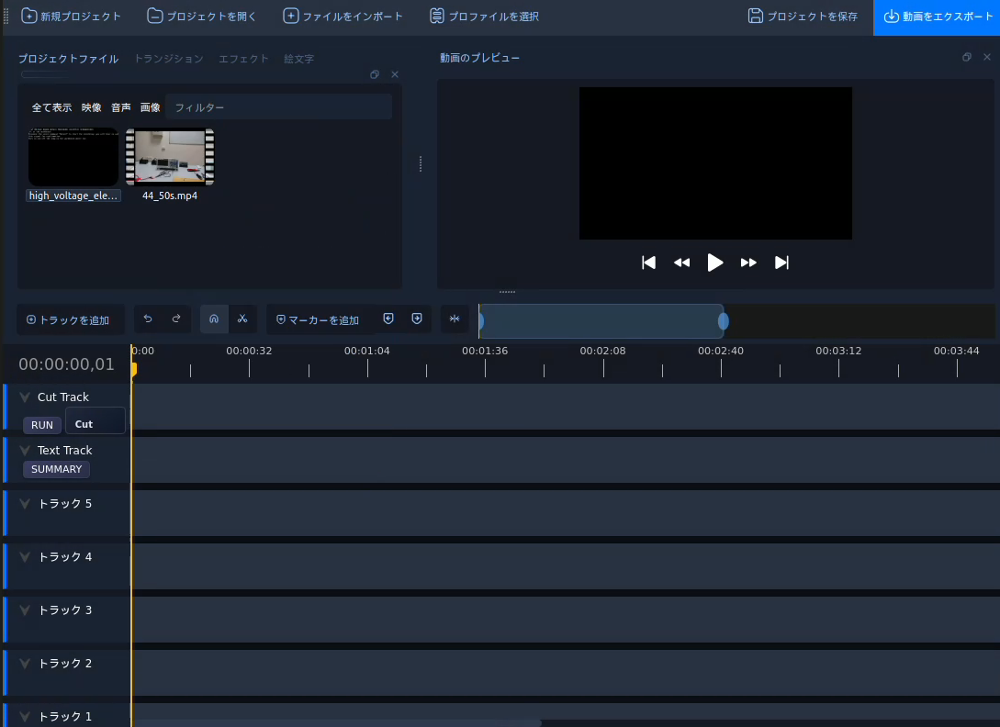
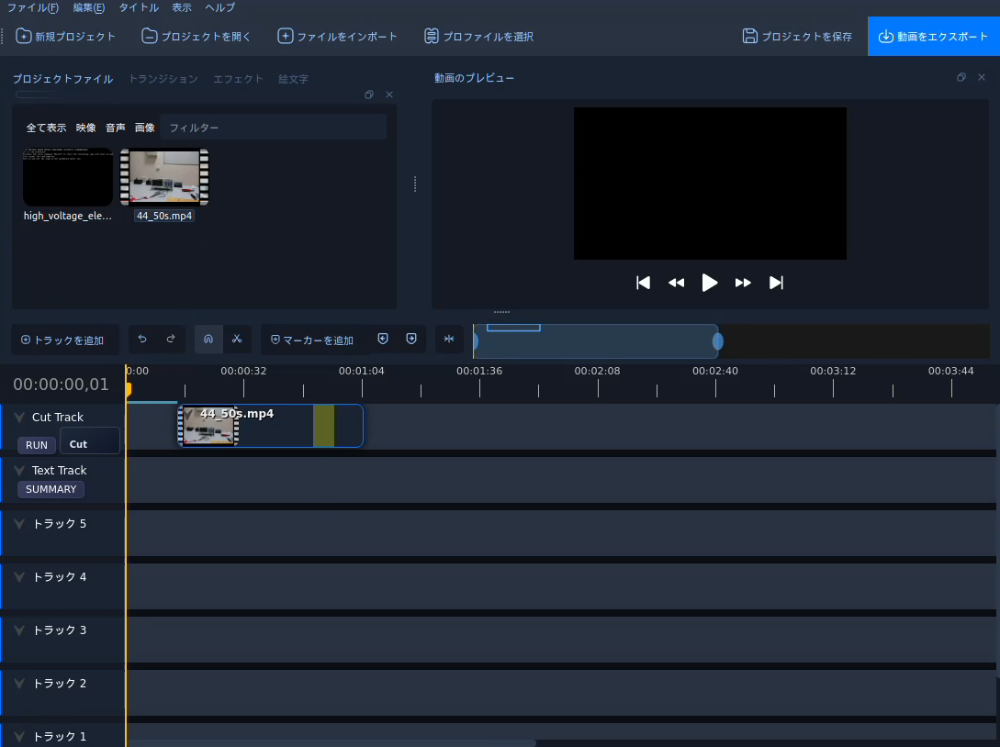
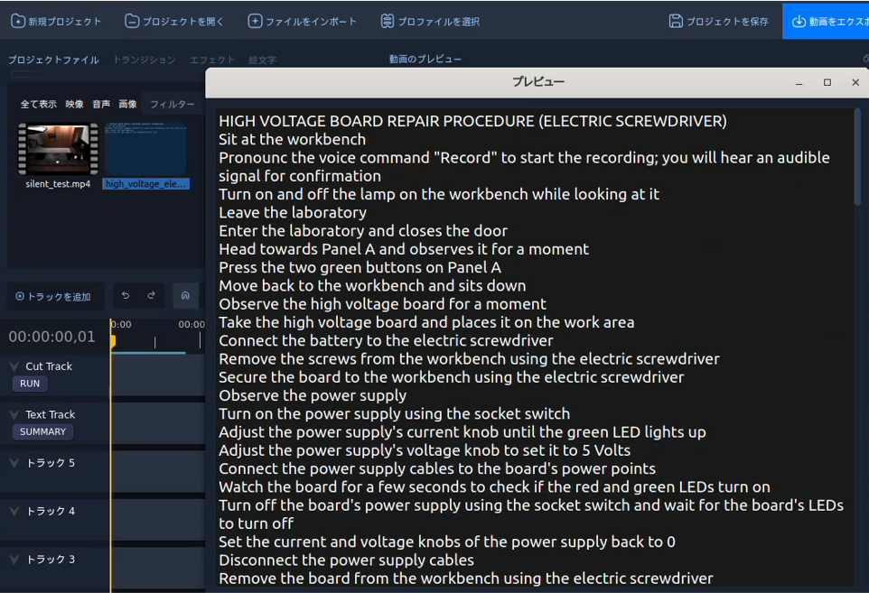
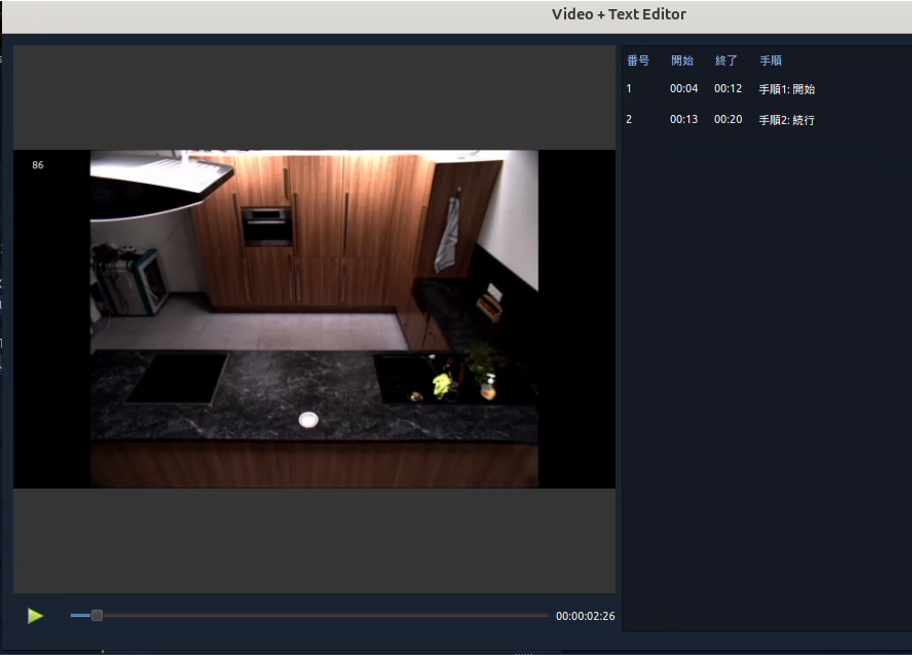

# OpenShot Video Editing Support
## 公式サイト
[OpenShot Official](https://www.openshot.org/)
[Github](https://github.com/OpenShot)


## Set up
```
sudo apt install software-properties-common
sudo add-apt-repository ppa:openshot.developers/libopenshot-daily
sudo apt-get update
sudo apt-get install openshot-qt 
                     cmake 
                     libx11-dev 
                     libasound2-dev 
                     libavcodec-dev 
                     libavdevice-dev 
                     libavfilter-dev 
                     libavformat-dev 
                     libswresample-dev 
                     libavutil-dev 
                     libfdk-aac-dev 
                     libfreetype6-dev 
                     libjsoncpp-dev 
                     libmagick++-dev 
                     libopenshot-audio-dev
                     libprotobuf-dev 
                     libqt5svg5-dev 
                     libswscale-dev 
                     libunittest++-dev
                     libxcursor-dev
                     libxinerama-dev
                     libxrandr-dev
                     libzmq3-dev
                     pkg-config
                     python3-dev
                     protobuf-compiler
                     qtbase5-dev 
                     qtmultimedia5-dev
                     swig
```
**libopenshot-audio**
```
cd libopenshot-audio
   mkdir build
   cd build
   cmake ../
   make install
```

**libopenshot**
```
cd libopenshot
mkdir build
cd build
cmake ../
make install
sudo ldconfig
```

**openshot-qt** 
```
cd openshot-qt
python src/launch.py
```

errorに対応して適宜
```
conda install -y pyqt=5 pyqtwebengine
conda install pyzmq
conda install requests
conda install soundfile
```


## 現状実装済み機能
無音区間のカット<br>
1.対象動画ファイルを「Cut Track」へDrag＆Drop<br>


2.待機後、無音区間が黄色いハイライトとして表示<br>


3.「RUN」ボタン押下で要約動画生成

テキストのプレビュー<br>


テキストと動画のシステム側(python)への送信<br>
1.対象動画ファイルを「Cut Track」、テキストをへCut Track」Drag＆Drop<br>
2. 「SUMMARY」ボタン押下で作業を行っている区間を表示(現在はダミーデータ)<br>


3.「RUN」ボタン押下で要約動画生成
